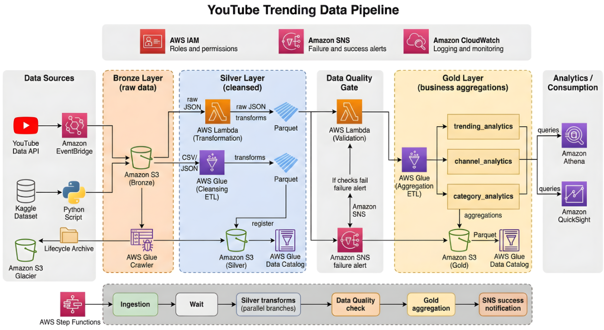
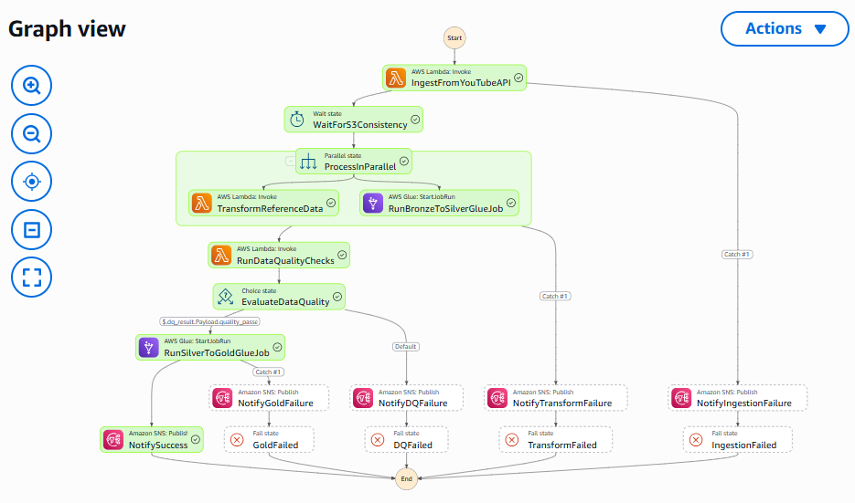

# YouTube Trending Data Pipeline

An end-to-end, serverless data engineering pipeline on AWS that ingests YouTube
trending video data, processes it through a **medallion architecture**
(bronze → silver → gold), validates it with an automated data-quality gate, and
serves analytics-ready tables to Athena and QuickSight — all orchestrated by AWS
Step Functions.

Built to understand the *reasoning* behind each architectural and configuration
decision, not just to wire services together.

---

## Architecture



Raw data lands in **S3 Bronze**, is cleaned and typed into **S3 Silver**, passes
through a **data-quality gate**, and is aggregated into **S3 Gold** analytics
tables served to Athena and QuickSight. IAM, SNS, and CloudWatch span every stage,
and AWS Step Functions orchestrates the entire flow (bottom rail).

---

## Why a medallion architecture?

The pipeline follows the **bronze → silver → gold** pattern, with each layer
stored as Parquet in its own S3 bucket and catalogued in Glue.

| Layer  | Contents | Purpose |
|--------|----------|---------|
| **Bronze** | Raw, untouched ingested data (JSON/CSV) | Immutable landing zone — preserves source of truth |
| **Silver** | Cleaned, typed, deduplicated, enriched | Trustworthy, query-ready detail records |
| **Gold** | Business-level aggregations | Analytics-ready tables for BI / dashboards |

Separating the layers means each stage has a single responsibility, failures are
isolated, and raw data is never lost — you can always reprocess from bronze.

---

## Key design decisions

**Parquet over CSV throughout.** Columnar storage, compression, preserved data
types, and partition pruning make Athena queries dramatically cheaper and faster
than scanning raw CSV.

**Hive-style partitioning by region** (`region=xx/`). Lets Athena and Spark skip
irrelevant partitions entirely (partition pruning) rather than scanning the whole
dataset.

**Least-privilege IAM.** Each component runs under its own scoped role. Object
actions use object-level ARNs (`bucket/*`); list actions use bucket-level ARNs;
Glue Data Catalog actions use `Resource: "*"` (a catalog constraint, not
laziness); SNS/Athena are scoped by ARN. All three policies are versioned in
[`IAM_policies/`](./IAM_policies).

**Catalog as the integration layer.** Downstream consumers (Athena, the DQ Lambda,
the gold job) address data by *catalogued table name*, not by S3 path — so they're
insulated from where the data physically lives.

**A data-quality gate between silver and gold.** Bad data shouldn't propagate.
The DQ Lambda runs row-count, null-percentage, schema, value-range, and freshness
checks, returns a pass/fail verdict, and the Step Functions workflow only proceeds
to gold if quality passes — otherwise it alerts and stops.

**Serverless orchestration.** Step Functions coordinates the whole flow with
`.sync` (wait-for-completion) Glue steps, a parallel branch for independent
transforms, automatic retries with backoff, and catch-to-alert error handling.

---

## Repository structure

```
youtube_data_pipeline/
├── data/                              # source dataset (not committed)
├── lambda/
│   ├── youtube-api-ingestion/         # YouTube API → Bronze S3 (event-driven)
│   │   └── lambda_function.py
│   └── json-parquet/                  # reference JSON → Silver Parquet
│       └── lambda_func.py
├── glue_jobs/
│   ├── bronze-silver-statistics.py    # Bronze → Silver: clean, dedup, enrich, type
│   └── silver-gold-analytics.py       # Silver → Gold: join + aggregate (3 tables)
├── data_quality/
│   └── dq_lambda.py                   # quality gate: row/null/schema/range/freshness
├── step_function_orchestrator/
│   └── SF_orchestration.json          # Step Functions state machine (ASL)
├── IAM_policies/
│   ├── yt-data-pipeline-glue-access.json
│   ├── yt-data-pipeline-lambda-access.json
│   └── yt-data-pipeline-sfn-access.json
└── scripts/                           # helper scripts
```

---

## Pipeline stages in detail

### 1. Ingestion (Lambda)
Event-driven (EventBridge schedule) Lambda that pulls trending videos and category
reference data from the YouTube Data API per region, adds pipeline metadata, and
writes raw JSON to the bronze bucket with Hive-style partitioning
(`region=xx/date=.../`). Replaces a manual "download + `aws s3 cp`" workflow with
automated live ingestion.

### 2. Cataloguing (Glue Crawler)
A crawler scans the bronze `raw_statistics/` prefix, infers the CSV schema and
`region` partitioning, and registers a table in the bronze Glue database — so the
downstream Spark job can read by table name.

### 3. Bronze → Silver
- **Reference data (Lambda + AWS SDK for pandas):** flattens category JSON,
  deduplicates, writes partitioned Parquet, and registers the `reference_data`
  table.
- **Statistics (Glue PySpark job):** schema enforcement and type casting, null
  handling, date parsing (`YY.DD.MM` → date), derived metrics (`like_ratio`,
  `engagement_rate`), window-function deduplication (latest record per
  video/region/date), data-quality logging, and Snappy-Parquet output as
  `clean_statistics`.

### 4. Data Quality Gate (Lambda)
Queries the silver tables via Athena and runs five check families — row count, null
percentage on critical columns, schema completeness, value-range sanity, and
freshness. Returns `quality_passed: true/false`, which the orchestrator branches on.

### 5. Silver → Gold (Glue PySpark job)
Joins `clean_statistics` against `reference_data` to resolve category IDs to
human-readable names, then produces three analytics tables:

- **`trending_analytics`** — daily trending summaries per region
- **`channel_analytics`** — channel performance, ranked within each region
- **`category_analytics`** — category trends over time, with view-share %

### 6. Orchestration (Step Functions)
Chains the whole thing into one automated, self-checking workflow:

```
Ingest → Wait → Parallel(Reference | Bronze→Silver) → DQ Gate
      → [pass] → Gold → Success alert
      → [fail] → Alert → Stop
```

with `.sync` waits on Glue jobs, a parallel branch for independent transforms,
retries with backoff, and per-stage failure alerts.

A full successful execution — every step green, the quality gate passed, and the
run routed to gold:



---

## Tech stack

**AWS:** S3, Lambda, Glue (Crawlers + PySpark ETL), Athena, Step Functions, SNS,
CloudWatch, EventBridge, IAM, QuickSight
**Languages/libraries:** Python, PySpark, boto3, AWS SDK for pandas (awswrangler),
pandas
**Data:** Kaggle "Trending YouTube Video Statistics" + YouTube Data API v3
**Storage format:** Parquet (Snappy), Hive-partitioned by region

---

## Setup notes

> This repo is a reference implementation. Resource identifiers (AWS account ID,
> API keys) have been replaced with placeholders — substitute your own before
> deploying.

Prerequisites: an AWS account, the YouTube Data API v3 enabled with an API key,
and the source dataset in the bronze bucket.

High-level deployment order:
1. Create the S3 buckets (bronze / silver / gold / scripts) and Glue databases.
2. Create the IAM roles from [`IAM_policies/`](./IAM_policies) (replace
   `<ACCOUNT_ID>` placeholders).
3. Deploy the Lambdas (ingestion, reference, DQ) — attach the **AWS SDK for pandas**
   layer to those that use `awswrangler`.
4. Deploy the two Glue jobs; set their job parameters (databases, buckets, tables).
5. Run the crawler to catalogue bronze.
6. Create the Step Functions state machine from
   [`step_function_orchestrator/SF_orchestration.json`](./step_function_orchestrator).
7. Start an execution.

Configuration is passed via Lambda environment variables and Glue job parameters —
no resource names are hardcoded in the transformation logic.

---

## What I learned building this

- The distinction between the **Glue service** and the **Glue Data Catalog**, and
  why catalog actions require `Resource: "*"`.
- **Topic vs. subscription ARNs** in SNS (6 vs. 7 segments) — and how using the
  wrong one causes silent publish failures.
- Why **catalogued table names** decouple consumers from physical S3 paths.
- The full **Athena-on-a-role permission chain** (workgroup, result location,
  bucket verification) and how each missing piece surfaces as a distinct error.
- Spark fundamentals in practice: partition pruning, narrow vs. wide transforms,
  window functions, lazy evaluation, and caching reused DataFrames.
- Orchestration concepts — DAGs, `.sync` waits, choice/branch states, retries, and
  failure handling — and how they map across Step Functions and Airflow.
```
